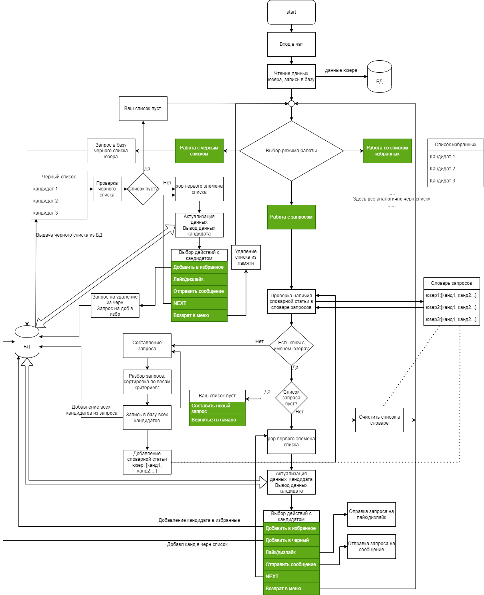

# VKinder

## Цель проекта

Цель командного проекта — разработать программу-бота для взаимодействия с базами данных 
социальной сети. Бот будет предлагать различные варианты людей для знакомств в 
социальной сети ВКонтакте в виде диалога с пользователем.

## Вам предстоит:

разработать программу-бота на Python,
спроектировать и реализовать базу данных (БД) для программы,
настроить взаимодействие бота с ВКонтакте,
написать документацию по использованию программы.
В результате выполнения этого задания вы:

получите практический опыт работы в команде;
прокачаете навыки коммуникации и умение выполнять задачи в срок;
закрепите навыки работы с GitHub и программирования на языке Python;
разработаете с нуля полноценный программный продукт, который можно будет добавить в портфолио бэкенд-разработчика.

Вы сможете реализовать проект в команде — сделаете бота по аналогии с Tinder. У людей, которые подошли по требованиям пользователю, бот будет отправлять топ-3 популярных фотографии с аватара. Популярность определяется по количеству лайков.
Бот будет уметь искать людей, подходящих под условия, на основании информации о пользователе из VK, используя:

- диапазон возраста
- пол
- город
- семейное положение

## Алгоритм работы с базой
1. При входе в чат-бот данные добавляются в талицу Users. Пользователь имеет возможность выбрать 3 режима работы - работать с запросом, работать со списком избранных, работать с черным списком.
2. При выборе режима работы с запросом:
- в словаре запроса ищем вк_ид пользователя. 
- Если вк_ид в списке ключей словаря, проверяется список. 
- Если он не пуст, выбирается первый ид кандидата из списка. 
- Делается проверяем дату создания записи в базе. Если она в пределах суток, ему выдается инфа по кандидату из базы.
- Если запись старше суток, делается запрос в вк, данные в базе актуализируются (метод DB.actualize_user) и выдается инфа из базы.
- Появляются кнопки - лайк/дизлайк, сообщение, отправить в избр, отправить в черн, некст
- При нажатии на некст, делается pop этого кандидата из списка, выдается инфа на следующего кандидата
- Когда список кандидатов опустеет, выдается сообщение, что запрост пуст и выход на начальный экран
- Если в словаре запроса нет ид юзера, он выходит в режим составления запроса.
3. При выборе режима работы со списками избранных/черным списком
- В словарь добавляем словарную статью - вк_ид: список кандидатов
- Проверяем актуальность, актуализируем если нужно, выдаем инфу по первому кандидату
- Появляются кнопки - лайк/дизлайк, сообщение, отправить в избр, отправить в черн, некст
- При нажатии на некст, делается pop этого кандидата из списка, выдается инфа на следующего кандидата
- Когда список кандидатов опустеет, выдается сообщение, что список пуст и выход на начальный экран
4. При создании нового запроса, все кандидаты добавляются в базу, в словарь в памяти добавляется словарная статья вк_ид: список запроса

